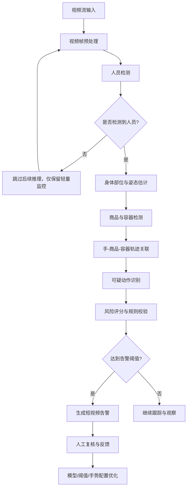

# Shoplifting Detection 技术方案

## 1. 方案目标

Shoplifting Detection 方案的目标是在门店已有视频流上构建一层 AI 行为分析能力，实时识别与偷盗相关的可疑动作，并输出可供人工复核的短视频告警。

核心目标包括：

- 识别顾客、身体部位、商品、包袋、购物车、婴儿车、头盔等对象。
- 分析商品与手部、身体、容器之间的时序关系。
- 检测商品被放入口袋、衣物、个人包、特殊容器或非正常结账容器的行为。
- 对批量拿取、货架扫货、拆包装、拆防盗装置、店内消费、自助结账漏扫等风险场景提供告警或人工复核线索。
- 通过历史告警、人工确认和误报反馈持续优化模型与规则。

方案定位是「AI 辅助防损」而不是自动执法系统。系统只输出可疑行为告警，最终是否干预、是否认定盗窃，仍由门店人员判断。

## 2. 技术路线

整体技术路线采用机器学习、深度学习和视频时序行为分析相结合的方式。

| 能力层 | 作用 |
|---|---|
| 人员检测 | 检测人员 |
| 目标检测 | 检测商品、手袋、背包、购物篮、购物车、婴儿车、头盔等对象 |
| 人体理解 | 识别人、手、手臂、身体姿态、运动方向和动作路径 |
| 时序分析 | 判断商品是否随手部移动，并进入衣物、包袋或其他容器 |
| 异常判断 | 识别偏离正常购物行为的动作模式，并触发风险评分 |
| 反馈学习 | 利用误报、确认告警和历史事件优化检测阈值与模型表现 |

## 3. 总体检测流程

## 4. 分层检测逻辑

方案采用类似「Brick」的分层检测逻辑，把复杂偷盗行为拆成多个可识别的视觉子任务。

### 4.1 人员检测

第一层判断画面中是否有人，并为每个顾客建立跟踪目标。该层输出人员位置、移动轨迹和所在摄像头区域。

该层同时作为后续推理链路的入口控制点：如果当前视频片段中没有检测到人员，则不再进入身体姿态估计、商品检测、容器检测和行为识别等高成本模块，只维持轻量级抽帧或低频人员检测。这样可以避免无人画面持续占用推理资源，降低 GPU / CPU 压力和整体延迟。

### 4.2 身体部位与动作检测

第二层估计身体关键部位，重点关注手、手臂、躯干、口袋附近、衣物边缘和身体朝向。该层用于判断：

- 手是否从货架取走商品。
- 商品是否被拿得异常贴近身体。
- 手部是否进入口袋、外套、袖口、衣服内侧等区域。
- 动作路径是否符合正常选购、查看、放回、放入购物篮等行为。

### 4.3 商品与容器检测

第三层识别商品以及可作为藏匿目标的容器，包括：

- 手袋、背包、行李箱、帆布袋、购物袋。
- 购物篮、购物车、个人推车。
- 婴儿车上方或下方区域。
- 摩托车头盔、可疑袋等特殊容器。
- 衣物、口袋、袖子、外套、裙子、裤子等身体附近藏匿区域。

### 4.4 关系建模与行为判断

第四层把人员、手部、商品和容器之间的空间关系与时间关系关联起来。重点判断：

- 商品是否被手部拿起。
- 商品是否持续跟随同一只手或同一人员移动。
- 商品是否进入非正常结账容器。
- 商品是否在进入衣物、包袋或特殊容器后消失。
- 动作是否符合已知 shoplifting pattern。

当商品移动路径、容器关系和动作上下文共同满足风险模式时，系统触发可疑事件。

## 5. 可检测动作与风险场景

### 5.1 核心可检测动作

| 动作类别 | 典型表现 | 检测重点 | 输出建议 |
|---|---|---|---|
| 衣物藏匿 | 商品被放入口袋、袖子、外套、裙子、裤子或衣服内侧 | 手部与商品靠近身体后，商品进入衣物区域并消失 | 高优先级告警 |
| 贴身可疑动作 | 商品被拿得非常贴近身体，但无法确认是否藏匿 | 商品与身体距离异常、动作持续时间异常 | 中优先级复核 |
| 个人包藏匿 | 商品进入手袋、背包、行李箱、帆布袋、购物袋或个人推车 | 商品轨迹与包袋开口区域重合，随后不可见 | 高优先级告警 |
| 特殊容器藏匿 | 商品进入头盔、婴儿车上方或下方、可疑袋等 | 商品与特殊容器发生进入关系 | 高优先级告警 |
| 批量拿取 | 多件散装商品被连续拿起并放入袋中 | 多商品轨迹、数量阈值、进入袋子动作 | 高优先级告警 |
| 货架扫货 | 大量商品从货架被快速拿走 | 单人在短时间内对同一区域执行高频拿取动作 | 中/高优先级告警 |
| 拆包装/拆防盗装置 | 打开包装、移除安全装置、药品 deblistering | 商品包装状态变化、手部精细操作、异常停留 | 中/高优先级复核 |
| 店内消费 | 直接在店内食用或使用商品 | 商品从货架到口部或使用动作，不经过正常结账流程 | 中优先级复核 |
| 自助结账漏扫 | 商品未被扫描或未进入正常结账流程 | 需要结合自助结账区域视频，最好与 POS 事件联动 | 风险线索 |

### 5.2 风险场景补充

部分传统偷盗技巧不一定能仅靠视频动作直接确认，但可以作为风险场景纳入系统设计：

- 标签替换、价格标签调换。
- 金属衬袋 / booster bag。
- 防盗门干扰器。
- 使用磁铁拆除防盗标签。

这些场景更适合作为与 EAS、RFID、POS、库存系统结合的复合检测目标。AI 视频侧可提供袋内藏匿、拆包装、异常动作、异常容器使用等补充证据。

## 6. 系统模块设计

### 6.1 视频输入与预处理模块

输入门店摄像头的视频流，对视频帧进行抽帧、尺寸归一化、画质检查和时间戳同步。该模块应输出可被后续模型稳定处理的视频帧序列。

### 6.2 人员与姿态分析模块

负责检测顾客并估计关键身体部位，重点输出：

- person_id / track_id。
- 人体框和关键点。
- 手部、手臂、躯干、口袋附近区域。
- 人体朝向和移动方向。

实现时建议将人员检测拆为轻量前置门控和完整姿态分析两步。轻量前置门控只判断画面中是否存在人员；当无人时，直接丢弃或降采样处理该片段，不调用后续重模型。当有人时，再启动姿态估计、商品检测和行为识别链路。

### 6.3 商品与容器检测模块

负责检测商品和潜在藏匿容器，重点输出：

- item_bbox / container_bbox。
- 商品类别或粗粒度类型。
- 容器类型，例如 bag、backpack、cart、stroller、helmet、clothing region。
- 商品与容器之间的空间关系。

### 6.4 轨迹关联模块

负责在多帧视频中关联人员、手部、商品和容器，形成可解释的行为轨迹：

- hand-to-item association。
- item-to-person association。
- item-to-container association。
- item disappearance after concealment。

### 6.5 行为识别与风险评分模块

负责把轨迹和上下文映射为可疑动作类型，并输出风险评分。评分可由模型置信度、动作类型、商品数量、容器类型、动作持续时间、区域风险等级等因素共同决定。

建议输出字段：

| 字段 | 说明 |
|---|---|
| event_id | 可疑事件 ID |
| camera_id | 摄像头 ID |
| timestamp | 事件发生时间 |
| person_track_id | 关联人员轨迹 ID |
| event_type | 可疑动作类型 |
| confidence | 模型置信度 |
| risk_level | low / medium / high |
| reason_tags | 触发原因，例如 concealment_to_bag、item_disappeared、bulk_pickup |
| clip_uri | 告警短视频地址 |
| review_status | 待复核、确认、误报、忽略 |

### 6.6 告警与反馈模块

当风险评分超过阈值时，系统生成短视频片段并推送给门店人员复核。人工复核结果应回流系统，用于：

- 标记 true positive / false positive。
- 调整检测敏感度。
- 配置需要监控的手势类型。
- 对高误报区域或摄像头进行单独调参。
- 必要时启用 silence mode，降低非营业时段或低风险时段的干扰。

## 7. 告警策略

建议采用分级告警，而不是所有动作一律强提醒。

| 告警等级 | 触发条件示例 | 处理方式 |
|---|---|---|
| 高 | 商品明确进入衣物、个人包、头盔、婴儿车等非正常容器 | 即时推送短视频，要求人工快速复核 |
| 中 | 商品贴近身体、疑似拆包装、疑似扫货、疑似店内消费 | 推送复核或进入待审列表 |
| 低 | 单一异常动作但证据不足 | 记录事件，用于后续趋势分析 |

## 8. 模型训练与持续优化

训练数据应围绕「行为片段」组织，而不是只围绕单帧图片组织。每个训练样本建议包含：

- 视频片段。
- 人员框、手部关键点、商品框、容器框。
- 动作标签，例如 clothing_concealment、bag_concealment、bulk_pickup、shelf_sweeping。
- 事件起止时间。
- 是否确认偷盗或误报。
- 场景上下文，例如摄像头区域、货架类型、商品类型、是否自助结账区域。

持续优化机制包括：

- 从已确认告警中补充正样本。
- 从误报中补充难负样本。
- 按门店、摄像头、区域和手势类型调整阈值。
- 对高误报动作进行单独降权或增加上下文约束。
- 对高漏报区域检查摄像头角度、遮挡和画质。

## 9. 功能边界与注意事项

本方案应明确以下边界：

- 系统检测的是动作、商品移动和容器关系，不做人脸识别或个人身份识别。
- AI 告警不等同于盗窃定性，只能作为人工复核线索。
- 标签替换、价格欺诈、退货欺诈等非明显身体动作，不能仅依赖视频手势模型确认。
- 自助结账漏扫最好结合 POS 或自助收银事件，否则只能作为视频风险线索。
- 画质不足、遮挡、背光、过远视角、过宽视野和网络延迟都会影响检测效果。

## 10. 建议落地优先级

第一阶段优先实现高确定性、高防损价值的动作：

- 商品放入口袋、袖子、外套、衣服内侧。
- 商品放入手袋、背包、购物袋、个人推车。
- 商品放入婴儿车、头盔等特殊容器。
- 多件商品连续进入袋子。

第二阶段扩展中等确定性的风险行为：

- 商品贴近身体但未明确藏匿。
- 货架扫货和批量拿取。
- 拆包装、拆防盗装置、deblistering。
- 店内消费。

第三阶段与其他系统联动：

- 自助结账漏扫检测。
- 标签替换和价格欺诈风险识别。
- 与 EAS、RFID、POS、库存系统进行复合判断。
