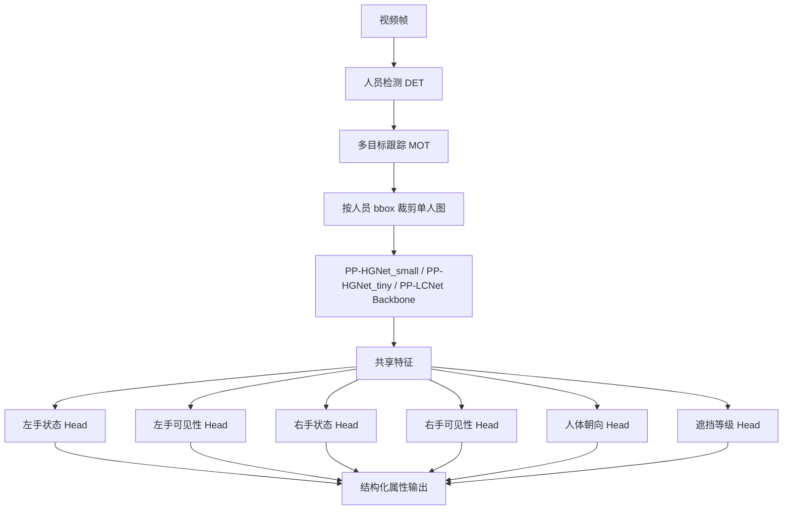
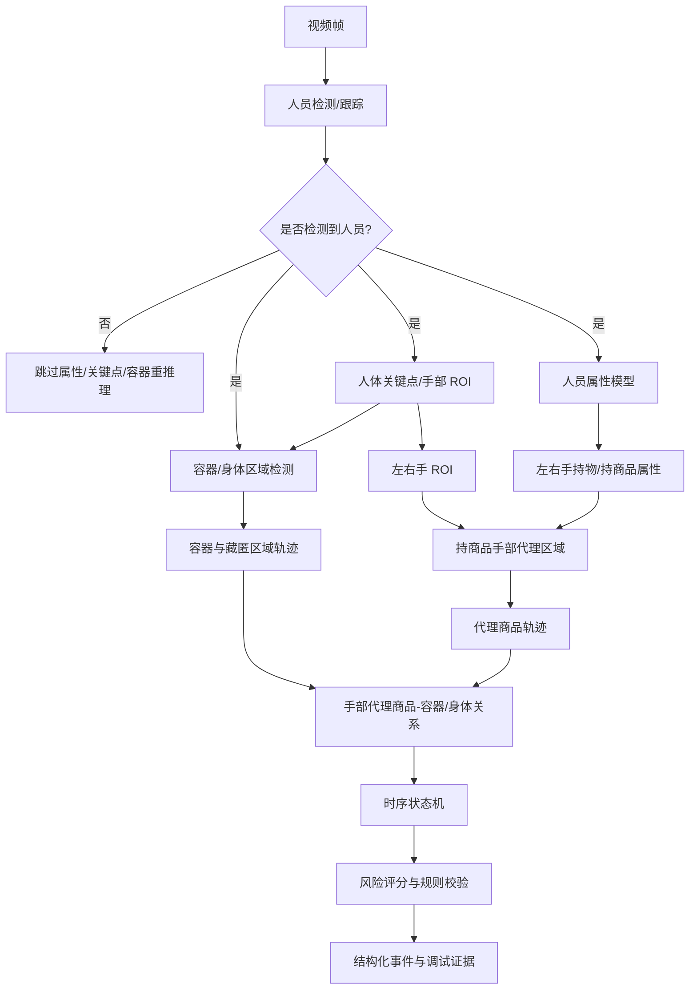
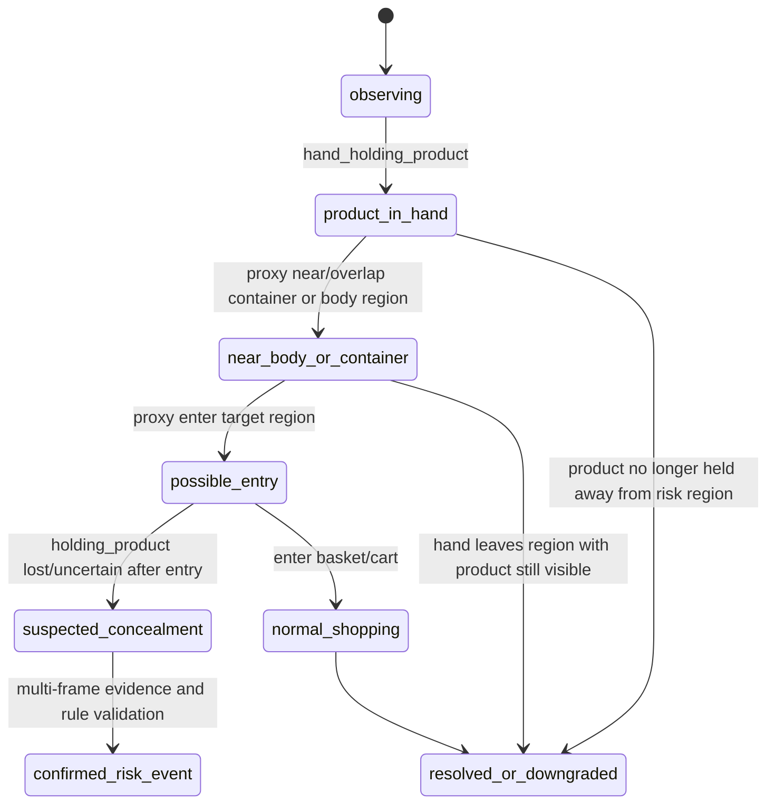

# 商超辅助偷盗行为预测人员属性模型设计

## 1. 目标定位

本文整理基于 PP-Human 行人属性识别模型改造的商超场景人员属性体系与模型架构。该模型不直接判断“偷盗”或“非偷盗”，而是输出与手部持物、商品接触、人体朝向和遮挡相关的可解释属性，作为后续时序行为分析、风险评分和人工复核的输入。

目标能力：

- 判断每个被跟踪人员左右手是否为空、是否持有普通物体、是否持有商品、是否无法判断。
- 判断左右手可见性，区分“没有持物”和“看不清/被遮挡/无法判断”。
- 判断人体朝向和整体遮挡等级，为后续偷盗行为预测提供置信度修正依据。
- 继承 PP-Human 的“检测/跟踪 -> 人体裁剪 -> 属性识别 -> 按 track id 聚合”的工程模式。

## 2. 基础模型来源

原始 PP-Human 属性识别模型为行人多属性分类模型：

| 项目 | 说明 |
|---|---|
| 原模型 | `PPHGNet_small_person_attribute_954` |
| 原任务 | 通用行人属性识别 |
| 原骨干 | PP-HGNet_small |
| 原指标 | mA 95.4 |
| 原输出 | 26 维 PA100K 风格行人属性 |
| 部署位置 | `src/PaddleDetection-release-2.9/deploy/pipeline/pphuman/attr_infer.py` |
| Pipeline 方式 | 先由 DET/MOT 得到行人框，再裁剪单人图输入属性模型 |

商超改造方向：

- 保留 PP-HGNet_small 作为图像分类Backbone。
- 将原 26 维通用属性头替换为商超人员属性多任务头。
- 输出从“通用穿着/年龄/包类属性”转为“手部状态、手部可见性、朝向、遮挡等级”。
- 后处理从固定阈值标签拼接，改为结构化 JSON 输出，便于时序模块消费。

## 3. 属性体系

### 3.1 字段总览

| 字段 | 类型 | 枚举值 | 说明 |
|---|---|---|---|
| `left_hand_state` | 多分类 | `empty`, `holding_object`, `holding_product`, `uncertain` | 左手状态 |
| `left_hand_visibility` | 多分类 | `clear`, `partial_occluded`, `not_judgable` | 左手可见性 |
| `right_hand_state` | 多分类 | `empty`, `holding_object`, `holding_product`, `uncertain` | 右手状态 |
| `right_hand_visibility` | 多分类 | `clear`, `partial_occluded`, `not_judgable` | 右手可见性 |
| `body_orientation` | 多分类 | `front`, `side`, `back`, `unknown` | 人体朝向 |
| `occlusion_level` | 多分类 | `none`, `light`, `heavy` | 人体整体遮挡等级 |

### 3.2 左右手状态

字段：

- `left_hand_state`
- `right_hand_state`

枚举定义：

| 枚举值 | 中文含义 | 标注口径 |
|---|---|---|
| `empty` | 手部为空 | 手部清晰可见，未持有明显物体或商品 |
| `holding_object` | 持有非商品物体 | 手中有手机、钥匙、钱包、个人袋子、票据、杯子等非门店商品 |
| `holding_product` | 持有商品 | 手中有商超货架商品、包装食品、饮料、日用品等可售商品 |
| `uncertain` | 状态不确定 | 手部不清、目标太小、严重运动模糊、遮挡、出画、难以区分是否持有商品 |

状态优先级：

1. 如果能明确判断手持门店商品，标为 `holding_product`。
2. 如果能明确判断手持物体但不是商品，标为 `holding_object`。
3. 如果手部清晰且没有物体，标为 `empty`。
4. 如果无法可靠判断，标为 `uncertain`。

### 3.3 左右手可见性

字段：

- `left_hand_visibility`
- `right_hand_visibility`

枚举定义：

| 枚举值 | 中文含义 | 标注口径 |
|---|---|---|
| `clear` | 清晰可见 | 手部主体清楚，能支持判断是否持物 |
| `partial_occluded` | 部分遮挡 | 手部部分被身体、货架、其他人、商品或画面边缘遮挡，但仍可见一部分 |
| `not_judgable` | 无法判断 | 手部完全不可见、严重模糊、过小、出画，无法支撑判断 |

与手部状态的关系：

- `clear` 通常应对应 `empty`、`holding_object` 或 `holding_product`。
- `partial_occluded` 可以对应任意手部状态，但置信度应降低。
- `not_judgable` 通常应对应 `uncertain`。

### 3.4 人体朝向

字段：

- `body_orientation`

枚举定义：

| 枚举值 | 中文含义 | 标注口径 |
|---|---|---|
| `front` | 正面 | 人体正面朝向摄像头或主要躯干/脸部方向可见 |
| `side` | 侧面 | 人体侧向明显，左右手可见性可能不对称 |
| `back` | 背面 | 人体背向摄像头，脸部和胸前区域不可见 |
| `unknown` | 朝向未知 | 遮挡、裁剪不完整、俯视角或画面质量导致朝向无法判断 |

### 3.5 遮挡等级

字段：

- `occlusion_level`

枚举定义：

| 枚举值 | 中文含义 | 标注口径 |
|---|---|---|
| `none` | 无明显遮挡 | 人体和双手大部分可见 |
| `light` | 轻度遮挡 | 局部被货架、商品、其他人员或画面边缘遮挡，但主要姿态仍可判断 |
| `heavy` | 重度遮挡 | 人体大面积遮挡，手部、躯干或关键区域无法稳定判断 |

## 4. 输出编码设计

推荐采用多任务多分类输出，共 6 个分类头：

| Head | 类别数 | 输出字段 |
|---|---:|---|
| `left_hand_state_head` | 4 | `left_hand_state` |
| `left_hand_visibility_head` | 3 | `left_hand_visibility` |
| `right_hand_state_head` | 4 | `right_hand_state` |
| `right_hand_visibility_head` | 3 | `right_hand_visibility` |
| `body_orientation_head` | 4 | `body_orientation` |
| `occlusion_level_head` | 3 | `occlusion_level` |

输出结构：

```json
{
  "track_id": 12,
  "bbox": [120, 80, 260, 430],
  "person_attribute": {
    "left_hand_state": {
      "label": "holding_product",
      "score": 0.87
    },
    "left_hand_visibility": {
      "label": "clear",
      "score": 0.91
    },
    "right_hand_state": {
      "label": "empty",
      "score": 0.76
    },
    "right_hand_visibility": {
      "label": "partial_occluded",
      "score": 0.68
    },
    "body_orientation": {
      "label": "side",
      "score": 0.82
    },
    "occlusion_level": {
      "label": "light",
      "score": 0.74
    }
  }
}
```

数值编码：

```yaml
left_hand_state:
  0: empty
  1: holding_object
  2: holding_product
  3: uncertain
left_hand_visibility:
  0: clear
  1: partial_occluded
  2: not_judgable
right_hand_state:
  0: empty
  1: holding_object
  2: holding_product
  3: uncertain
right_hand_visibility:
  0: clear
  1: partial_occluded
  2: not_judgable
body_orientation:
  0: front
  1: side
  2: back
  3: unknown
occlusion_level:
  0: none
  1: light
  2: heavy
```

## 5. 模型架构



## 6. 替代精确商品检测的方案流程

### 6.1 调整目标

原方案依赖独立商品检测模型输出 `item/product` 框，再通过手部 ROI、商品框和容器框建立 `hand_item_contact`、`item_follow_person`、`item_enter_container` 等关系。实际商超画面中，单件商品经常尺寸小、遮挡重、SKU 外观差异大，精确商品检测闭环的数据成本和稳定性风险较高。

调整后的方案不再把“精确商品框”作为 P0/P1 闭环前提，而是使用人员属性模型判断左右手是否持有商品：

- 当 `left_hand_state = holding_product` 时，以左手 ROI 近似该商品当前位置。
- 当 `right_hand_state = holding_product` 时，以右手 ROI 近似该商品当前位置。
- 当手部状态为 `holding_object`、`empty` 或 `uncertain` 时，不生成高置信商品位置，只作为低置信或排除证据。
- 容器检测仍然保留，用于识别包、背包、手袋、购物篮、购物车、婴儿车、头盔、衣物/口袋区域等潜在进入目标。

因此，新的核心证据从“商品检测框”变为“持商品手部代理区域”。该区域不是 SKU 级商品框，也不承诺覆盖真实商品边界，只表示“被某只手持有的商品大概率位于该手部附近”。

### 6.2 新流程总览



### 6.3 模块职责变化

| 模块 | 原职责 | 调整后职责 |
|---|---|---|
| 人员检测/跟踪 | 输出人员框和 `person_track_id` | 保持不变，作为属性模型、关键点和容器检测的入口门控 |
| 人体关键点/手部 ROI | 派生左右手区域，辅助商品接触判断 | 确定身体具体部位；输出稳定左右手 ROI，作为持商品时的商品位置代理 |
| 人员属性模型 | 未纳入原主链路 | 判断左右手是否 `holding_product`，并提供可见性、朝向、遮挡置信修正 |
| 商品检测 | 输出精确 `item/product` 框 | P0/P1 不作为必需模块；后续可作为增强证据接入 |
| 容器检测 | 检测包袋、购物篮、购物车等容器 | 保留，承担藏匿目标和正常购物容器区分 |
| 轨迹关联 | 关联手、商品、容器三类框 | 关联手部代理商品轨迹、人员轨迹、容器/身体区域轨迹 |
| 风险规则 | 基于商品进入容器/消失判断风险 | 基于持商品手部靠近/进入容器或身体区域、随后属性消失或可见性变化判断风险 |

### 6.4 持商品手部代理区域

当某只手满足以下条件时，生成一条 `proxy_item_region`：

1. 对应手部 ROI 存在，且来自关键点或手部检测。
2. 对应手状态为 `holding_product`。
3. 手部可见性不是高置信 `not_judgable`。
4. 人体整体遮挡不是持续 `heavy`，或仅生成低置信代理区域。

推荐结构：

```json
{
  "proxy_item_id": "p12_left_000345",
  "person_track_id": 12,
  "hand_side": "left",
  "frame_id": 345,
  "timestamp_ms": 11500,
  "proxy_bbox": [138, 212, 182, 256],
  "source_hand_roi": [132, 204, 188, 260],
  "state_label": "holding_product",
  "state_score": 0.87,
  "visibility_label": "clear",
  "visibility_score": 0.91,
  "confidence": 0.79,
  "is_precise_item_bbox": false
}
```

`proxy_bbox` 可先直接使用手部 ROI，也可以按手腕点、前臂方向和 ROI 尺寸做轻量偏移：

- 侧视或手臂伸出时，沿 elbow -> wrist 方向向外扩展一小段距离。
- 手部 ROI 较小或关键点不稳定时，使用原手部 ROI，不做额外偏移。
- 代理区域必须裁剪在人员框或画面边界内，并记录 `source_hand_roi` 便于复核。

### 6.5 代理商品轨迹

代理商品轨迹不再依赖跨帧商品检测 ID，而是以 `person_track_id + hand_side` 为主键聚合：

| 轨迹字段 | 说明 |
|---|---|
| `proxy_item_track_id` | 例如 `person_12_left_product` |
| `person_track_id` | 归属人员 |
| `hand_side` | `left` 或 `right` |
| `start_frame_id` / `end_frame_id` | 连续持商品片段范围 |
| `regions` | 每帧 `proxy_item_region` |
| `state_scores` | 每帧持商品置信度 |
| `visibility_states` | 每帧手部可见性 |
| `last_known_bbox` | 最后一次可信代理位置 |
| `lost_reason` | `released_or_put_down`、`occluded`、`entered_container`、`uncertain` |

轨迹切分建议：

- 连续多帧 `holding_product` 视为同一代理商品轨迹。
- 短时 1-3 帧抖动可通过时序平滑补齐。
- 从 `holding_product` 转为 `empty` 且远离容器/身体区域，倾向解释为放下或放回。
- 从 `holding_product` 转为 `uncertain` 或 `not_judgable`，且手部位于包袋、衣物、口袋、袖口、背包开口等区域附近，标记为高风险候选。
- 左右手同时 `holding_product` 时分别生成两条代理轨迹，风险规则可识别批量拿取。

### 6.6 关系建模替换

原 `hand_item_contact` 可替换为 `hand_holding_product`：

- 输入：左右手属性、手部 ROI、可见性。
- 输出：某只手在连续时间窗内持有商品的证据。
- 触发条件：`holding_product` 持续超过最小帧数或置信度加权时长。

原 `item_follow_person` 可替换为 `proxy_item_follow_person`：

- 输入：`proxy_item_region` 与 `person_track_id`。
- 输出：代理商品自然归属到对应人员和对应手。
- 冲突处理：同一人员双手分开建轨；多人重叠时如果手部 ROI 或属性来源不稳定，降低置信度。

原 `item_enter_container` 可替换为 `proxy_item_enter_container_or_body_region`：

- 输入：代理商品区域、容器框、衣物/口袋/身体区域、人员框。
- 输出：持商品手部代理区域与容器/身体区域的接近、重叠、进入关系。
- 关系类型：
  - `proxy_near_body`
  - `proxy_enter_bag`
  - `proxy_enter_backpack`
  - `proxy_enter_handbag`
  - `proxy_enter_clothing_region`
  - `proxy_enter_pocket_region`
  - `proxy_enter_basket_or_cart`
  - `proxy_enter_special_container`

原 `item_disappeared_after_entry` 可替换为 `holding_product_lost_after_entry`：

- 输入：进入关系后的手部状态变化、手部可见性变化、代理轨迹终止原因。
- 输出：商品疑似进入容器或衣物后不再可见的证据。
- 高风险不能只由“属性从持商品变为非持商品”单独触发，必须结合进入关系、持续帧和上下文。

### 6.7 风险事件判断

新方案建议使用如下状态机：



事件类型映射：

| 事件类型 | 新证据组合 | 风险建议 |
|---|---|---|
| `bag_concealment` | 持商品手部代理区域进入包/背包/手袋区域，随后持商品属性消失或变为不可判断 | 高 |
| `clothing_concealment` | 持商品手部代理区域进入口袋、袖口、外套内侧或贴身衣物区域，随后属性消失或可见性下降 | 高 |
| `special_container_concealment` | 代理区域进入婴儿车、头盔、可疑袋等特殊容器后商品状态丢失 | 高 |
| `near_body_suspicious` | 持商品手部长时间贴近身体或被衣物遮挡，但没有明确进入/消失证据 | 中 |
| `bulk_pickup_to_bag` | 左右手或连续片段多次生成持商品代理轨迹，并进入个人包袋 | 中/高 |
| `normal_container_put_in` | 代理区域进入购物篮/购物车且路径自然，默认降权或豁免 | 低/豁免 |

### 6.8 置信度与降级策略

代理商品区域比精确商品框更粗，因此风险评分必须更强调时序一致性和多证据交叉：

- 高风险事件至少需要 `hand_holding_product`、`proxy_enter_*`、`holding_product_lost_after_entry` 中的两个以上原因标签。
- 单帧 `holding_product` 不触发高风险，只能作为观察状态。
- `holding_object` 不能等同于商品；除非后续人工或其他模型补充确认，否则只进入低风险观察。
- `visibility = not_judgable` 不能被解释为“空手”，应优先解释为证据不足或遮挡。
- `occlusion_level = heavy`、`body_orientation = back`、多人重叠、货架遮挡严重时降低风险等级。
- 进入购物篮/购物车等正常容器时默认降权；只有结合异常区域、异常停留、反复拿取等证据时才提升为复核线索。

## 7. 对现有开发路线的影响

基于上述替换，开发优先级建议调整为：

1. 优先训练/接入商超人员属性模型，稳定输出左右手 `holding_product`、可见性、朝向和遮挡等级。
2. 保留并强化人体关键点/手部 ROI，因为它直接决定代理商品位置质量。
3. 保留容器检测与身体区域检测，重点识别个人包袋、购物篮/购物车、特殊容器、衣物/口袋区域。
4. 将 `item/product` 精确检测从 P1 闭环必需项调整为后续增强项。
5. 将关系模块从“手-商品-容器”改为“持商品手部代理区域-容器/身体区域”。
6. 调试可视化必须区分手部 ROI、代理商品区域、真实容器框和后续可选真实商品框。

### 7.1 当前框架集成状态

当前代码已先完成框架级集成，真实属性模型权重仍需后续训练或导出：

| 能力 | 当前状态 | 位置 |
|---|---|---|
| 属性数据结构 | 已实现 `AttributePrediction`、`PersonAttribute`、`ProxyItemRegion` | `shoplift/core/types.py` |
| 属性后处理 | 已实现可见性一致性修正、softmax/label 解析 | `shoplift/vision/person_attribute.py` |
| 代理商品区域 | 已实现 `holding_product + HandRegion -> ProxyItemRegion` | `shoplift/vision/person_attribute.py` |
| 模型研发代码 | 已补充 backbone wrapper、多任务 head、dataset、train、export | `shoplift/models/person_attribute/` |
| 离线链路 | 已输出 `person_attributes`、`proxy_item_regions`，并将代理区域送入现有关联器 | `shoplift/cli/offline_analyze.py` |
| PP-Human 后端 | 已预留 Paddle Inference 属性模型入口 | `shoplift/backends/paddledet_pphuman_backend.py` |
| 可视化 | 已绘制代理商品区域 | `shoplift/cli/offline_analyze.py` |

未配置真实属性模型时，离线链路使用保守规则估计器：可见手默认 `empty`，不可见手默认 `uncertain`，不会凭空生成 `holding_product`。只有后端返回真实 `PersonAttribute`，或测试 fixture 明确设置 `holding_product`，才会生成 `proxy_item_region`。

配置示例：

```yaml
backend:
  type: paddledet_pphuman
  person_attribute:
    enabled: true
    model_dir: ./models/shoplift/person_attribute
    threshold: 0.5
    batch_size: 8
    image_width: 192
    image_height: 256
    min_holding_product_score: 0.5

modules:
  pose_hand:
    enabled: true
  person_attribute:
    enabled: true
    min_holding_product_score: 0.5
  proxy_item:
    enabled: true
```

属性模型导出要求：

- 本地目录必须包含 `inference.pdmodel` + `inference.pdiparams`，或 `model.pdmodel` + `model.pdiparams`。
- 输入为人员 crop batch，默认 NCHW RGB，尺寸 `192x256`，使用 ImageNet mean/std 归一化。
- 输出可为 6 个 head，也可为一个拼接的 21 维向量，顺序为：左手状态 4、左手可见性 3、右手状态 4、右手可见性 3、人体朝向 4、遮挡等级 3。

### 7.2 训练代码与预训练参数

模型研发代码路径：

```text
shoplift/models/person_attribute/
├── labels.py      # 6 个 head 的标签定义与 loss 权重
├── backbones.py   # PPHGNetV2 / LCNet / tiny_cnn backbone wrapper
├── model.py       # backbone + shared embedding + 6 个分类 head
├── dataset.py     # CSV/JSONL 标注读取与 person crop 预处理
├── train.py       # 训练入口
└── export.py      # Paddle Inference 导出入口
```

推荐 backbone：

| Backbone | 配置 | 适用场景 |
|---|---|---|
| `pphgnetv2` `S` | 默认推荐 | 精度优先，后续可接 PaddleDetection/PaddleClas 预训练参数 |
| `pphgnetv2` `N` | 更轻量 | 数据量较小或 CPU/GPU 资源有限 |
| `lcnet` `1.0` | 轻量基线 | 推理速度优先 |
| `tiny_cnn` | smoke test | 验证训练链路，不建议作为正式模型 |

预训练参数放置路径：

```text
models/pretrained/person_attribute/
├── pphgnetv2_s_pretrained.pdparams
├── pphgnetv2_n_pretrained.pdparams
└── lcnet_1_0_pretrained.pdparams
```

示例配置：

```yaml
backbone:
  name: pphgnetv2
  arch: S
  paddledetection_root: ./src/PaddleDetection-release-2.9
  pretrained: ./models/pretrained/person_attribute/pphgnetv2_s_pretrained.pdparams
```

训练命令：

```powershell
conda run -n shoplift-paddle python -m shoplift.models.person_attribute.train --config shoplift/configs/person_attribute.example.yml
```

导出命令：

```powershell
conda run -n shoplift-paddle python -m shoplift.models.person_attribute.export --config shoplift/configs/person_attribute.example.yml --weights outputs/person_attribute/best.pdparams --output-dir models/shoplift/person_attribute/inference --format concat
```

导出后在离线推理配置中启用：

```yaml
backend:
  type: paddledet_pphuman
  person_attribute:
    enabled: true
    model_dir: ./models/shoplift/person_attribute/inference
```

框架级验证命令：

```powershell
conda run -n shoplift-paddle python -m pytest shoplift/tests
```

最近一次验证结果：在 `shoplift-paddle` 环境下收集 78 个测试，全部通过。该验证不包含真实属性模型权重训练，只覆盖模型代码脚手架、配置解析、属性后处理、proxy item 生成、PP-Human 后端接入点和现有离线/事件链路回归。

## 8. 后处理规则

建议在模型 softmax 输出后增加轻量规则，提升属性一致性。

规则建议：

- 如果 `left_hand_visibility = not_judgable` 且其置信度超过阈值，则强制或倾向设置 `left_hand_state = uncertain`。
- 如果 `right_hand_visibility = not_judgable` 且其置信度超过阈值，则强制或倾向设置 `right_hand_state = uncertain`。
- 如果 `occlusion_level = heavy`，则整体属性置信度下调。
- 如果 `body_orientation = back`，则胸前持物、正面商品接触相关结论应降低置信度。
- 连续多帧输出应做时序平滑，避免单帧抖动造成风险分数跳变。

时序平滑建议：

| 字段 | 推荐策略 |
|---|---|
| 左右手状态 | 最近 5-15 帧多数投票或置信度加权投票 |
| 左右手可见性 | 对 `not_judgable` 保持敏感，避免误判为空手 |
| 人体朝向 | 使用 track 级平滑，减少 front/side/back 抖动 |
| 遮挡等级 | 可用最大风险策略，短时间 `heavy` 应降低风险判断可靠性 |
